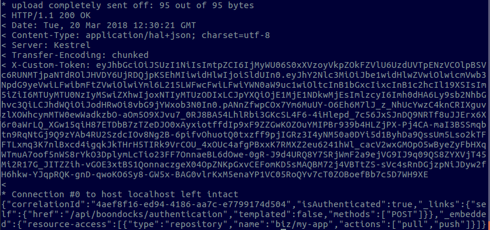
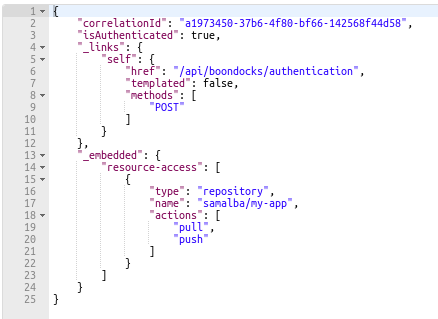
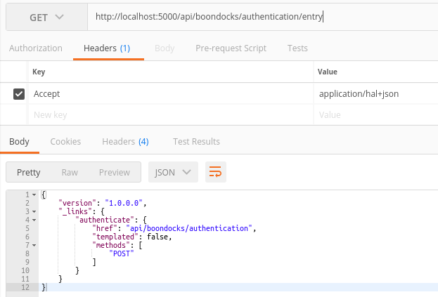
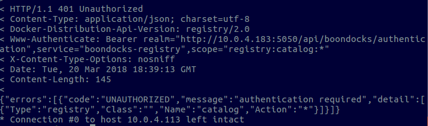
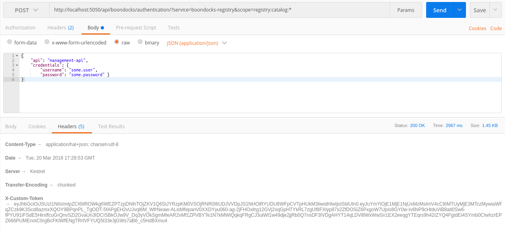
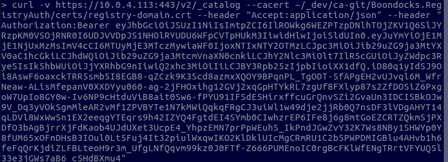
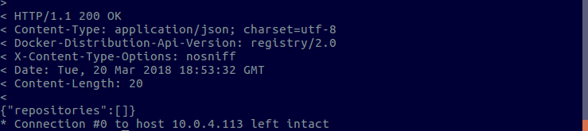

# Boondocks.Auth
The following contains a summary of configuring the Boondocks.Auth microservice.  This service issues authentication tokens.  If the caller's credentials can be authenticated, the signed token will contain the resources to which they have access.  In the context of authentication is a Docker Registry, a claim is added indicating the resources and the actions permitted by the caller.

* Note:  In the below shell commands, specific IP addresses are referenced.  These should be replaced with your specific address:

  * 10.0.4.113:443 - Docker Registry Server
  * 10.0.4.183:5050 - Authorization Microservice
  * localhost:5000  - Same as 10.0.4.183:5050 but running with attached debugger

## Configuring Authentication Microservice
* Create private key and public certificate used for signing authentication tokens:

* $ cd ~
* $ mkdir certs

```bash
openssl req \
	 -newkey rsa:4096 -nodes -sha256 \
   -keyout certs/auth-private.key -x509 -days 356 \
   -out certs/auth-public.crt
```

* Combine the private key and public certificate into a pfx file:

```bash
openssl pkcs12 \
	-inkey certs/auth-private.key -in certs/auth-public.crt \
	-export -out certs/auth-private.pfx
```

* Copy the auth-private.pfx file to the certs directory of the Boondocks.RegistryAuth project directory.
* For local development running within a local web server process, specify the path to the auth-private.pfx file within the appsettings.json file of the Boondocks.Auth.WebApi web application.  When running the microservice within Docker, this path should be specified using an environment variable.

```json
{
  "boondocks": {
    "auth": {
      "jwt": {
        "issuer": "boondocks-auth-api",
        "audience": "boondocks-registry",
        "validForMinutes": 10080,
        "certificateFilePath": "certs/auth-private.pfx"
      },
      "ldap": {
        "domain": "BIZ",
        "connection": "ldap.biz.com",
        "port": "389"
      }
    }
  },

  "netfusion": {
    "plugins": {

    }
  }
}
```

## Test Authentication Microservice
* The microservice determines the provider used to preform the authentication, for a given requesting service, by using the value of the "api" property contained within the body of the post.
* The mapping of the value of the "api" property to its corresponding provider can be found in the class implementing the IAuthProviderRegistry:

```C#
public class ProviderRegistry : AuthProviderRegistry
    {
        public override void Build()
        {
            Add<DeviceAuthProvider>("device-api")
                .ForValidIssuers("boondocks-issuer")
                .ForValidAudiences("boondocks-api");

             Add<ActiveDirectoryAuthProvider>("management-api");
        }
    }
```
* In this case the service is configured to invoke the ActiveDirectoryAuthProvider when the service requesting authentication sets the "api" property value to "management-api".

* Assuming the the above configuration is in place, update the "ldap" application settings as needed:

```json
 "ldap": {
    "domain": "BIZ",
    "connection": "ldap.biz.com",
    "port": "389"
```

* Make the following post using a known valid account as follows:

```bash
curl -v \
	-d '{"api":"management-api", "credentials":{"username":"some.user", "password":"some-password"}}' \
	-H "Accept: application/hal+json" \
	-H "Content-Type: application/json" \
	-X POST 'http://10.0.4.183:5050/api/boondocks/authentication?service=registry.docker.io&scope=repository:biz/my-app:pull,push'
```



* Note the following about the request and response:

  * When requesting authorization to a resource (Docker Registry Repository), this information is provided on the query string.  The "service" query string parameter specifies the owner of the resource (Docker Registry) and the "scope" query string parameter specifies the resource and the actions to be checked.  Multiple scopes can be provided by specifying multiple "scope" query string parameters.  
  * The "Accept" header indicates that the response should be returned as HAL if supported.  In this case, it is supported so the results looks as follows:

  

* The service also has an entry resource that can be queried by clients needing to consume the authentication service.  The entry resource contains the entry URIs that can be called to start communication with the service API.  In this case, there is only one service API method but this can change overtime as the authentication service is expanded:




# Local Docker Registry Setup and JWT Token Authorization
With the above in place, the following outlines the steps required to configure a local Docker Registry instance with TLS and JTW token authorization.  The following steps should be completed on the server that will host the registry.  

## Configuring TLS
For a local Docker Registry to be accessible from remote clients, it must be configured to use TLS.

The following is required for a self-signing certificate.  If not present, a Docker Client accessing the registry will receive an exception that the certificate is not signed by a known CA.  Replace IP address with that of the server on which the registry is being configured.

* $ cd ~
* $ mkdir certs #if not done in prior step
* $ cp /etc/ssl/openssl.cnf certs
* $ echo [ v3_ca ] >> certs/openssl.cnf
* $ echo subjectAltName = IP:10.0.4.113 >> certs/openssl.cnf

The following creates the self-signed certificate using the above modified configuration file:

```bash
openssl req \
  -config certs/openssl.cnf \
  -newkey rsa:4096 -nodes -sha256 -keyout certs/registry-domain.key \
  -x509 -days 365 -out certs/registry-domain.crt
```

The next command is not required but can be used to view the contents of the certificate.  In the results, the above IP address specified for subjectAltName should be listed:

* $ openssl x509 -in certs/registry-domain.crt -text -noout

NOTE:  If the above IP address is not listed for subjectAltName, verify that the following line exists and is not commented out within the openssl.cnf file: x509_extensions = v3_ca

Copy the created certificates and keys to proper directories:

* $ sudo cp certs/*.crt /etc/ssl/certs
* $ sudo cp certs/*.key /etc/ssl/private

The following will download the Docker Registry image and create a container that is started using the above self-signed certificate:

```json
docker run -d \
  --name registry \
  --read-only \
  --mount type=bind,source=/etc/ssl/certs,target=/certs \
  --mount type=bind,source=/etc/ssl/private,target=/keys \
  -e REGISTRY_HTTP_ADDR=0.0.0.0:443 \
  -e REGISTRY_HTTP_TLS_CERTIFICATE=/certs/registry-domain.crt \
  -e REGISTRY_HTTP_TLS_KEY=/keys/registry-domain.key \
  -p 443:443 \
  registry:2
```

Verify that the registry instance was started:

* $ docker ps -a

## Required Client Configurations when TLS Enabled

For testing, complete the below on another computer with the docker CLI installed so the request will be cross server.  The following is optional and used to test pushing of an image to a custom Docker Registry.  

* $ docker pull ubuntu:16.04
* $ docker tag ubuntu:16.04 10.0.4.113:443/ubuntu-test 
* $ docker push 10.0.4.113:443/ubuntu-test

If a client attempts to push an image to the above configured registry, it will receive the following error: x509: certificate signed by unknown authority.  The following command will fail since the docker CLI has not be configured with the TLS public-certificate:

* $ docker push 10.0.4.113:443/ubuntu-test

Each docker client host must have a copy of the certificate.  Docker looks in the following directory for certificates:  /etc/docker/certs.d/10.0.4.113:443/ca.crt

The following creates this file for the prior IP address being used after copying the generated certificate from the server:

* copy registry-domain.crt from server to local certs directory.

The following will copy the public TLS certificates to the proper location:

$ sudo mkdir -p /etc/docker/certs.d/10.0.4.113:443
$ sudo cp certs/registry-domain.crt /etc/docker/certs.d/10.0.4.113:443/ca.crt

If everything is configured correctly, the pull command should now work:

* $ docker push 10.0.4.113:443/ubuntu-test

The following is optional but shows how to use the certificate when making a request to the Docker registry using curl:

curl -v --header 'Accept:application/json' https://10.0.4.113:443/v2/_catalog --cacert certs/registry-domain.crt

The following should return a json document listing the images stored on the registry.  Ubuntu-test should be listed if all prior steps worked correctly.

## Configuring Docker Registry JWT Token Authorization

The following will configure the Docker Registry to use JWT Authorization.  This configuration will allow signed JWT tokens returned from the Boondocks.Auth microserivce to be used.  This service was configured in a prior step.    

A PEM file needs to be generated from the auth-public.crt file generated in the ***Configuring Authentication Microservice*** section.

* $ openssl x509 -in certs/auth-public.crt -out certs/auth-public.pem -outform PEM

On the Docker Registry server, copy the generated PEM file to the following location:

* $ sudo cp auth-public.pem /etc/ssl/certs
* Stop the running Docker Registry container instance and delete the container.

Execute the following to create a new container configured with JWT Authorization that will accept tokens signed by the Boondocks.Auth microservice:

```bash
docker run -d \
  --name registry \
  --read-only \
  --mount type=bind,source=/etc/ssl/certs,target=/certs \
  --mount type=bind,source=/etc/ssl/private,target=/keys \
  -e REGISTRY_HTTP_ADDR=0.0.0.0:443 \
  -e REGISTRY_HTTP_TLS_CERTIFICATE=/certs/registry-domain.crt \
  -e REGISTRY_HTTP_TLS_KEY=/keys/registry-domain.key \
  -e REGISTRY_AUTH=token \
  -e REGISTRY_AUTH_TOKEN_SERVICE="boondocks-registry" \
  -e REGISTRY_AUTH_TOKEN_ISSUER="boondocks-auth-api" \
  -e REGISTRY_AUTH_TOKEN_ROOTCERTBUNDLE=/certs/auth-public.pem \
  -e REGISTRY_LOG_LEVEL=debug \
  -e REGISTRY_AUTH_TOKEN_REALM=http://10.0.4.183:5050/api/boondocks/authentication \
  -p 443:443 \
  registry:2
```

## Testing Client to call Docker Registry with JWT Authorization Enabled
 
Curl will be used to test calling the registry.

First make a call to the registry without specifying an authorization token:

```bash
curl -v https://10.0.4.113:443/v2/_catalog --cacert ~/_dev/ca-git/Boondocks.RegistryAuth/certs/registry-domain.crt --header "Accept:application/json" 
```

The registry will respond with a 401 status code as follows:



Note that the registry responds with a challenge as specified within the ***Wwww-Authenticate*** header:

Bearer realm="http://10.0.4.183:5050/api/boondocks/authentication",service="boondocks-registry",scope="registry:catalog:*"

The header indicates the following:

* The client is to make a request to the authorization service specified with the ***realm** named property.
* The client is to pass its needed credentials and also notify the authentication service that it needs access to the specified scope.

If the client successfully authenticates, it will return a signed token with an access claim specifying the resources and allowed actions allowed.  This will be the same as the scope specified if the authenticated client has full access to the scope.  If the client does not have full access, the returned access claim will be a subset of the resources and actions allowed by the requesting client. 

The following shows making a request to authenticate the client and to determine the resources and allows actions.  This information will be returned in a signed JWT token contained within the response header for a HTTP 200 Status Code.



Lastly, reissue the original request and specify the generated token:



If the successful, the registry should return a HTTP 200 status code as follows:


